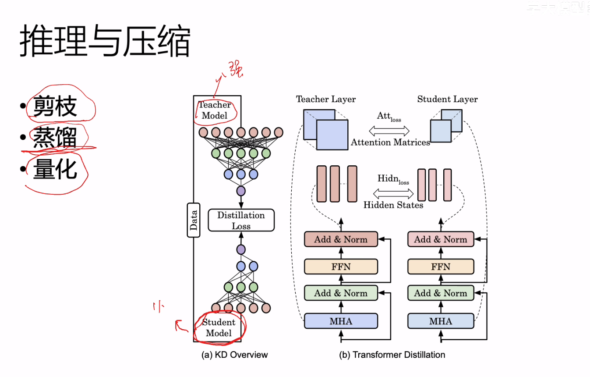

较熟悉python、Golang，pytorch、transformer、使用过Vit、DETR、LLama大语言模型、whisper、Bert、k8s等。有基于lora的大模型微调的基础经验。

# 项目总结

## 舆情分析

从0-1完成舆情分析项目搭建开发

项目介绍

​	使用scrapy、selenium等完成对主流媒体的公司舆情信息爬取，经过数据清洗后，输入至BaiChuan(7B)大模型中进行分析，完成部分网站爬虫开发，大模型prompt开发，使用openLLM大模型框架提升模型吞吐量，针对视频、音频数据，使用whisper(1.5B)模型完成音频转文字任务，并输入至语言大模型。使用Go语言的gin服务框架完成模型调用服务开发，并将模型部署至k8s。*基于lora等完成对大模型的微调工作*

LLama、LLM、多模态、openLLM、whisper、prompt、lora、scrapy、selenium、Golang、gin、k8s

### 爬虫

#### scrapy、selenium的使用

#### 不重复爬取

#### 定时任务

#### 随机UA

基于scrapy框架提供的中间件模块，完成不重复爬取中间件的开发，在每次启动服务时，会从S3中读取到已经爬取到的url的json发送request请求时，

### 数据清洗、处理

#### spark、数据清洗集群

### 语音转文字模型

#### whisper模型原理

#### whisper模型部署

#### whisper模型微调

#### whisper中间件（golang）

### LLM

#### LLM框架

#### LLM部署

#### LLM中间件（golang）

#### LLM微调

## 场景挖掘

### 项目架构

#### 执行流程

### Vit原理及源码

### Vi-DETR

## HuggingFace源码阅读

## 多模态基础

### Zero-shot

### CLIP

## LLM基础

### 大模型推理与部署

模型推理，生成和分类用的不同的推理方式

对于分类模型，我们只需要取最开头那个 [CLS] token

任务范式的转移，分类任务变成生产任务

#### 解码策略

##### 贪心搜索GreedySearch

哪个概率高走那条路径

缺点：找到的并不一定是概率值最高的。

##### 柱搜索BeamSearch

设置超参选择柱数量，用于储存前beam个概率最大的结果

##### 让每次生成的结果有所不同--Top-KSampling

需结合BeamSearch使用

我们可以发现已知词越多，后面的概率值越高。

**因为是取前K个，如果这里面有概率值极小的，生成的句子也会不合理**

**Top-K的问题就是，它只关注了前K个概率，但是没关注概率分布，概率值是多少**

##### Top-PSampling

找**概率和**为95%的数据拿出来，而不是固定前几个

实际上还是使用Top-K更多些

##### 防止说重复的话--对比搜索

degenernation 惩罚项，让它与之前已经生成的结果做相似度计算

##### 让结果生成的更快--AssistGenernation

先让小模型生成结果，大模型评价，大模型觉得生成的结果不满足要求再自己生成

#### 把之前计算的结果保存下来--KVCache

将KV结果矩阵存在内存里，让我们的大模型生成速度更快

attention计算时，只计算新来的embedding

### 放到不同的GPU里--并行化

#### pipline Parallelism

pipline并行，或放在不同的GPU里

#### Tensor Parallelism

#### Sequence Paralleism

对于顺序执行的部分，我们可以看成一个整体的模块然后并行计算

在推理阶段依旧可以多GPU并行计算

### Attention优化

一组KV对于多个Query，提升Attention计算速度

### Flash attention

内存角度优化计算速度，将多个模块的操作打包成kernel，避免数据传输消耗的时间

### 模型量化

通过模型的量化，可以将模型中的参数和激活值从浮点数转换为较低位宽的定点数或者整数。这种技术的目标是在尽可能保持模型性能的前提下，减小模型的存储需求和计算复杂度。

### 大模型测评方法

### 微调

#### Lora

Adapter Tuning存在训练和推理延迟，Prefix Tuning难训且会减少原始训练数据中的有效文字长度

## NLP基础

### Transformer

​	attention：Scaled-dot-product Attention

​	1、分词（tokenize）：[CLS] The boy is sleeping.[SEP]

  				input_ids : [101, 464, 2993, 11029, 13, 102]

  2、词嵌入（embedding）：分词变成词向量：word2vec（同一个单词embedding是固定的）、GloVe、BERT（同一个单词embedding会根据所在语句不同而

不同）

原句：                                               Your                       cat   is   a   lovely   cat.

Embedding(原文中是512维度):  （1， 512）

位置编码： 也是512 与embedding相加

#### 绝对位置编码

在求位置编码时，会针对句子中每个词的pos和每个词的512个维度分别利用下面这个公式计算，偶数个用sin奇数用cos

#### 注意力机制

假设我们输入的句子有6个token，那么我们要得到它的QKV，就是简单地给这个6x512矩阵复制三份出来，注意这个不是参数矩阵，而是将embedding编码成QKV。

下面那个6x6矩阵就是QxK^T

这个注意力机制为什么叫Scaled-xxx-attention，因为除了根号下dk

为什么要除以根号下 dk（dk 表示 Key 的维度），这是为了缩放（scale）注意力权重，以确保在点乘的过程中不会因为维度较大而导致梯度变得过小，从而影响模型的训练稳定性。

#### Multi-head

这里会把QKV和对应的W参数矩阵相乘之后再分出多个head，目的是可以让不同的head学习到不同的信息，关注不同的token。

#### Add&Norm

让训练更加稳定，类似于dropout

add指的是残差操作

batchNorm是在一个batch中的不同样本对应位置之间做normalization，LayerNorm是同一层，也就是一个batch内部做normalization，使得其均值为0方差为1。

#### Masked-Multi-head Attention

添加mask是在QK^T的位置添加，把mask掉的地方初始化成-inf，这样在做softmax时直接就变成0了（e^−∞=0）

#### self-Attention与cross-Attention

self-Attention是一个句子在句子内部做的attention，cross-Attention是跨句子的attention

#### 训练过程

encoder输入翻译前的句子，decoder输入翻译结果。

decoder输入会右移一位：

确保在解码时，每个位置的输出只与它前面的位置的输出相关，而不受到当前位置之后的影响。

在实际操作中，右移一位的操作通常是通过在序列的开始添加一个特殊的起始符号（例如，开始符号 `<sos>`）来实现的。这样，模型的第一个输入就是 `<sos>` 符号，而实际的目标序列从第二个位置开始。

#### 推理过程

推理时，第一次输入<SoS>，第二次接着输入“<SoS>我”，依次下去，直到推理<EoS>。

这种decoder又称为causalDecoder（因果），该解码器是自回归的（autoregressive）。自回归模型是一种在生成序列时一个接一个地生成每个元素的模型。

"Causal" 表示因果关系，因此 "causal decoder" 意味着在生成输出序列的每个时间步时，模型只能依赖于之前的已生成部分，而不能依赖于未来的部分。这是通过确保在每个时间步只使用已生成的部分作为上下文来实现的。

 通常通过在每个解码器的自注意力机制（self-attention mechanism）中应用一个掩码（mask）来实现。

#### 自回归模型

自回归模型是一种生成模型，其生成的序列是按照时间步顺序逐个元素生成的模型。在自回归模型中，生成的每个元素依赖于前面已生成的元素。

简而言之，自回归模型通过考虑序列中先前的元素来生成下一个元素。这种模型通常用于处理时序数据或序列数据，如文本生成、语音合成等任务。

#### Transformer的优化

Transformer的时间复杂度

On^2，其中n为输入序列长度

Low-Rank，使用低秩矩阵进行近似计算

##### 稀疏矩阵方法--减小计算量

Sliding window attention 每个token只看与其临近的几个token的attention。

Dilated：隔一个算一次attention

BigBird：full-attention + windowsized-attention  +random-attention

##### 推理与压缩

剪枝、蒸馏、量化

给强模型剪枝，使其剪枝后的模型输出尽可能接近强模型

### BERT/GPT/BART

Masked language modeling：mask掉一个词，然后去预测这个词。

